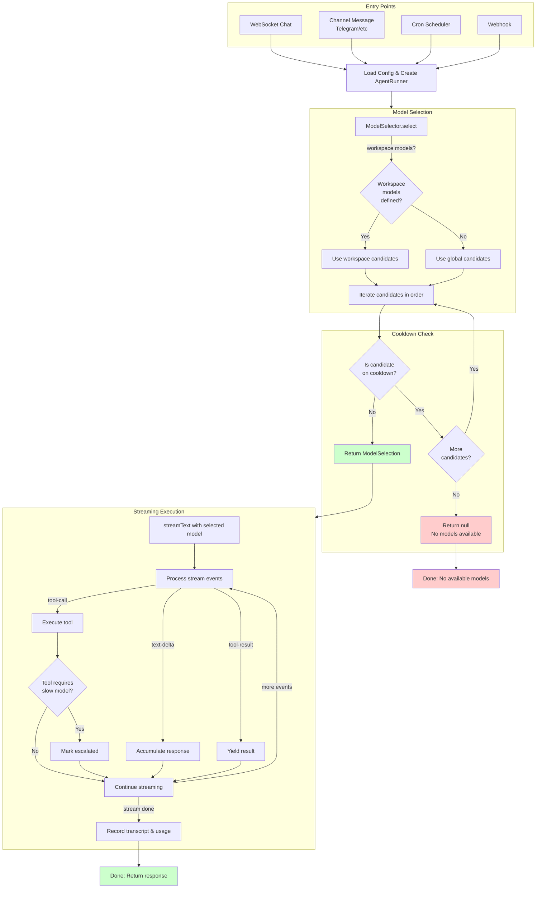
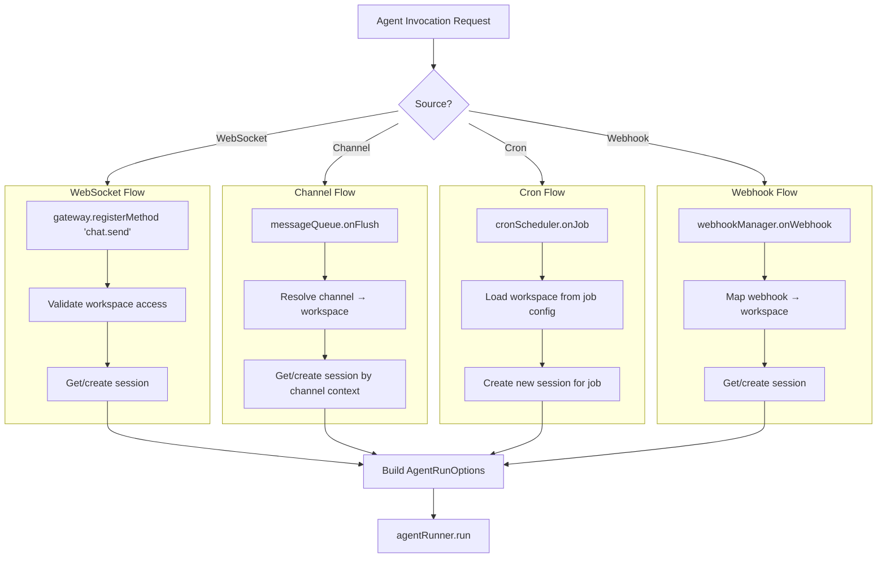
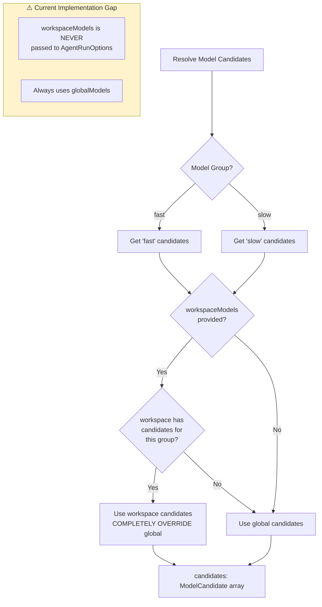
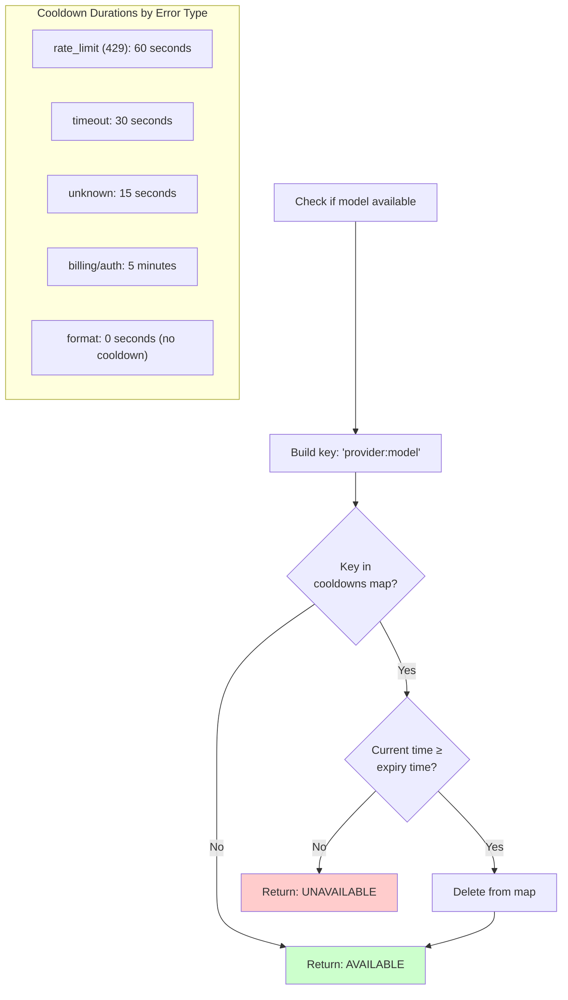
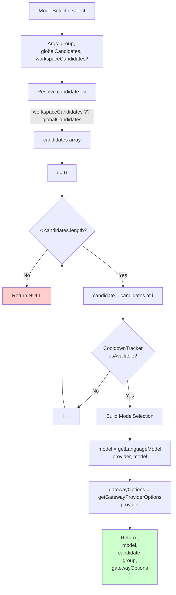
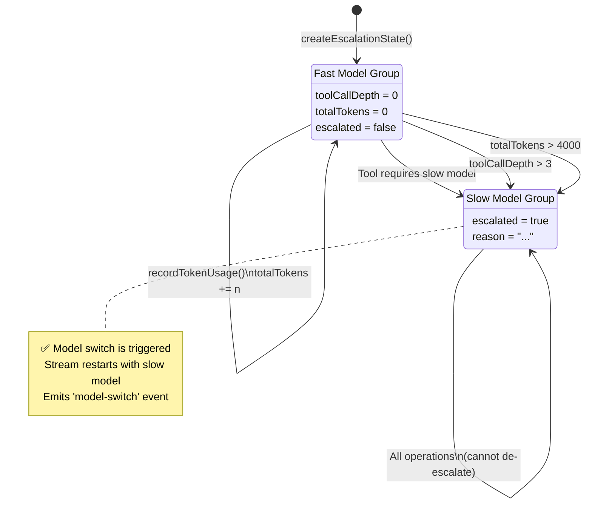
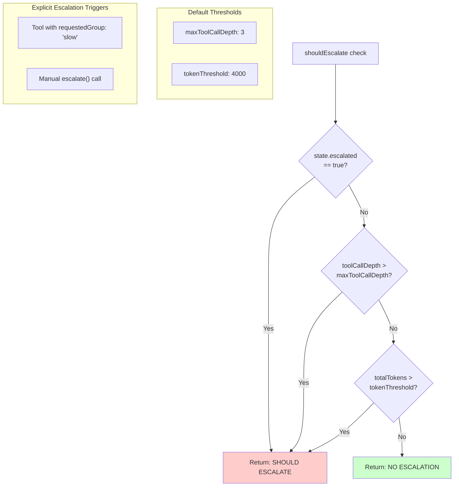
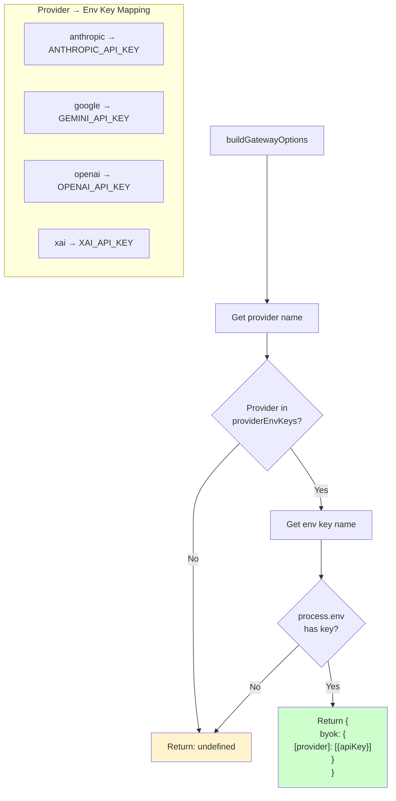
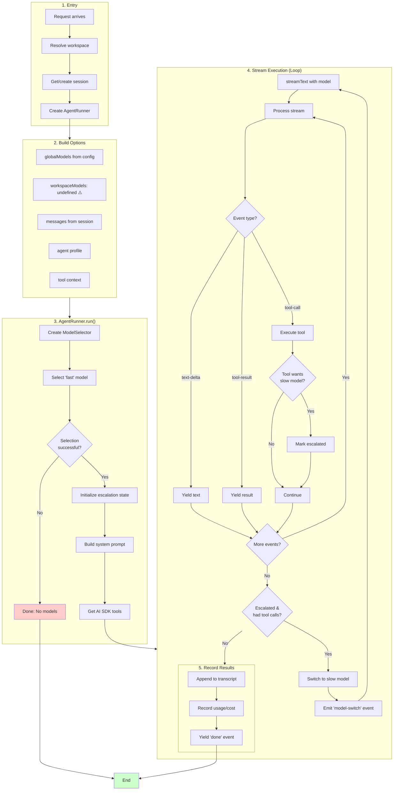

# Model Selection Flowchart

This document details all decision trees for determining which model gets used when an agent is invoked.

## High-Level Overview



## Detailed Decision Trees

### 1. Entry Point Resolution



### 2. Model Candidate Resolution



### 3. Cooldown Tracking



### 4. Model Selection Algorithm



### 5. Escalation State Machine



### 6. Escalation Decision Tree



### 7. Gateway BYOK Resolution



### 8. Error Classification (Failover)

```mermaid
flowchart TD
    START[classifyError]
    START --> ERR[Examine error]

    ERR --> STATUS{HTTP Status?}

    STATUS --> |429| RATE[rate_limit]
    STATUS --> |401/403| AUTH[auth]
    STATUS --> |other| MSG{Error message<br/>contains?}

    MSG --> |"rate limit"<br/>"too many requests"| RATE
    MSG --> |"unauthorized"<br/>"forbidden"<br/>"api key"| AUTH
    MSG --> |"billing"<br/>"quota"<br/>"insufficient"| BILLING[billing]
    MSG --> |"timeout"<br/>"etimedout"<br/>"econnreset"| TIMEOUT[timeout]
    MSG --> |"invalid"<br/>"malformed"<br/>"bad request"| FORMAT[format]
    MSG --> |none match| UNKNOWN[unknown]

    RATE --> RETRY{Retryable?}
    TIMEOUT --> RETRY
    UNKNOWN --> RETRY

    AUTH --> NORETRY[NOT Retryable<br/>Throw immediately]
    BILLING --> NORETRY
    FORMAT --> NORETRY

    RETRY --> |Yes| COOLDOWN[Add to cooldown<br/>Try next candidate]

    subgraph LEGEND["⚠️ Implementation Gap"]
        L1[Failover logic EXISTS but<br/>is NOT USED in AgentRunner]
        L2[Uses streamText directly<br/>not streamWithFailover]
    end

    style NORETRY fill:#ffcccc
    style COOLDOWN fill:#fff3cd
```

### 9. Complete End-to-End Flow



## Implementation Status

| Feature | Status | Notes |
|---------|--------|-------|
| Workspace model overrides | ❌ Not wired | Always uses global models |
| Escalation model switch | ✅ Implemented | Switches to slow model when thresholds exceeded |
| Failover cascade | ❌ Not called | No automatic retry on model failure |
| Tool-requested slow model | ✅ Implemented | Triggers escalation and model switch |

## Key Files

| File | Purpose |
|------|---------|
| `apps/bot/src/index.ts` | Entry points (WebSocket, Channel, Cron, Webhook) |
| `packages/core/src/agent/runner.ts` | Main agent execution loop |
| `packages/core/src/ai/model-group.ts` | ModelSelector, CooldownTracker |
| `packages/core/src/ai/escalation.ts` | Escalation state machine |
| `packages/core/src/ai/failover.ts` | Error classification, retry logic (unused) |
| `packages/core/src/ai/provider.ts` | Provider factory (openai, anthropic, gateway) |
| `packages/schemas/src/config.ts` | Config schema definitions |
